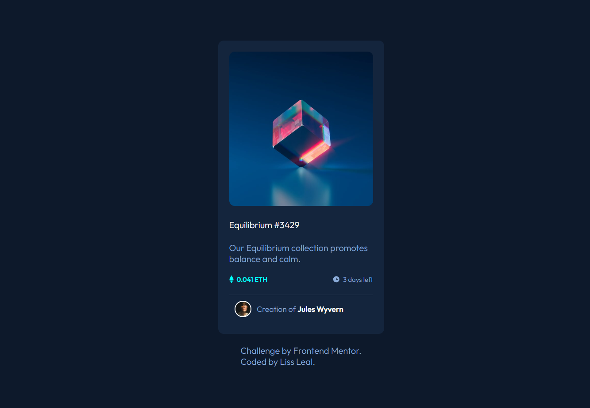

# Frontend Mentor - NFT preview card component solution

This is a solution to the [NFT preview card component challenge on Frontend Mentor](https://www.frontendmentor.io/challenges/nft-preview-card-component-SbdUL_w0U). 

## The challenge

Users should be able to:

- View the optimal layout depending on their device's screen size
- See hover states for interactive elements

## Screenshot

## Links

- Solution URL: 
- Live Site URL: 

## Built with

- HTML5 markup
- CSS custom properties
- Flexbox
- Position 

## Continued development

I´am not quite comprehend how to use the positions properties, I´ve struggled a little with the eye hover, overall I thing I found a simple solution.

## Author

- Frontend Mentor - [Lissett Leal](https://www.frontendmentor.io/profile/lissleal)

